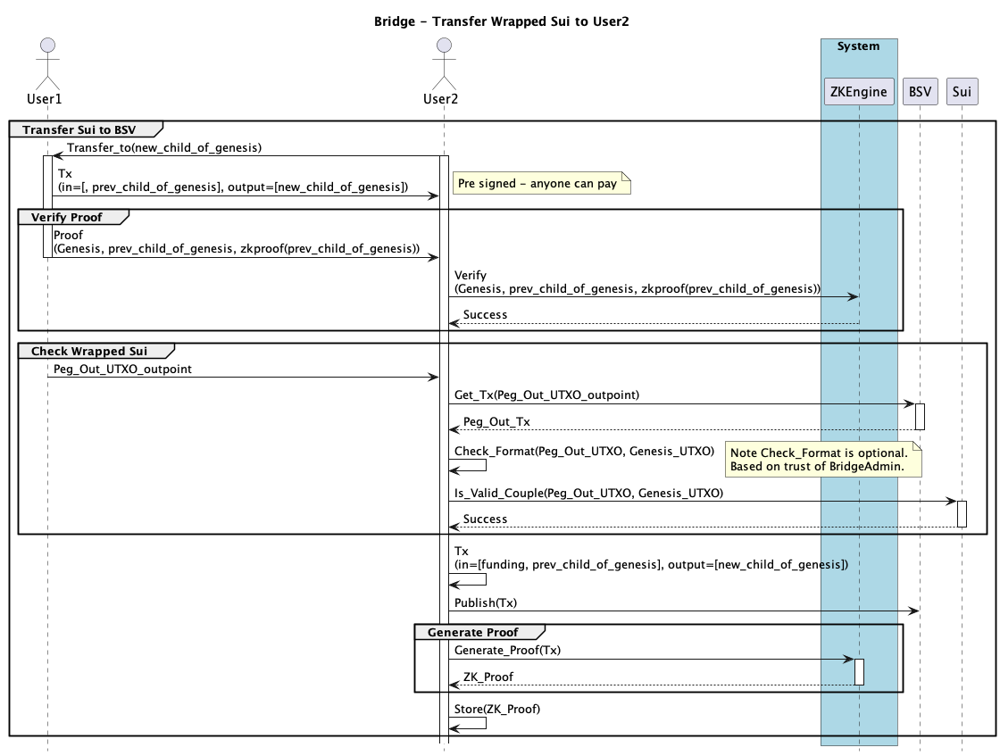

# System Design

This document captures the system design for this project.

## System Overview

This diagram captures the key use cases supported by this project.

The `Admin` performs on initial project setup:
1) `Upload Oracle Smart Contract` 
2) `Upload Bridge Smart Contract` , note this is dependent on 1) 
3) `Setup ZKEngine`

## Transfer Sui to BSV

This diagram shows the interactions required to Transfer Sui to BSV.

Note that the `Check Sui` stage, checks
* Time of `Peg_Out_UTXO`, is within 10 mins
* Format of ...

## Transfer Wrapped Sui

This diagram shows the interactions required to Transfer Wrapped Sui on BSV between Users.

Note that the `Check Sui` stage is not currently implemented.

## Transfer BSV to Sui (Unlocking Sui)

This diagram shows the interactions required to Unlock Sui.

This currently takes a BSV tx of 330K, however Sui currently is limited to objects of 256K.

