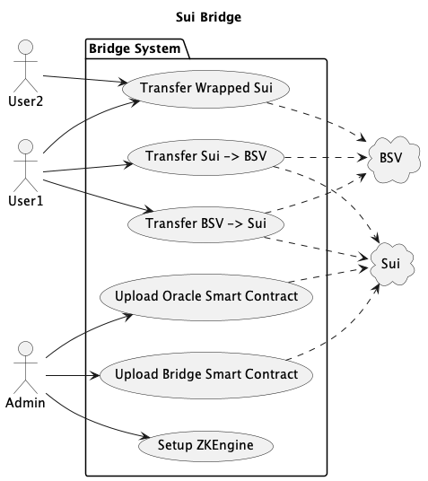

# System Design

This document captures the system design for this project.

## System Overview

This diagram captures the key use cases supported by this project.

The `Admin` performs `Setup ZKEngine` and `Upload Bridge Smart Contract` on initial project setup.

## Transfer Sui to BSV

This diagram shows the interactions required to Transfer Sui to BSV.

Note that the `Check Sui` stage, checks
* Time of `Peg_Out_UTXO`, is within 10 mins
* Format of ...

## Transfer BSV to Sui
